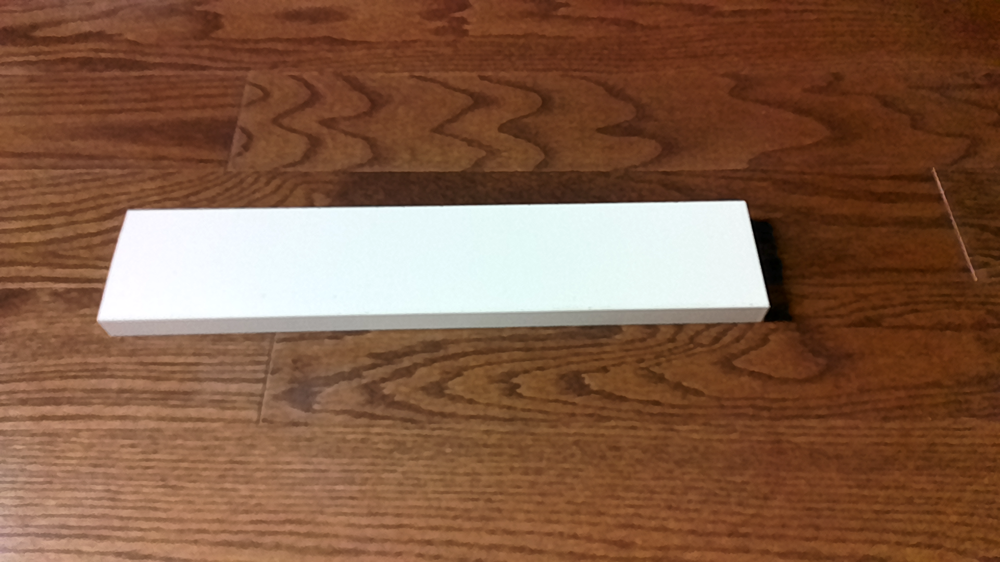
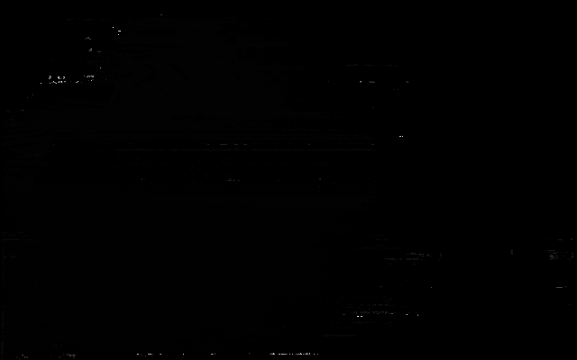
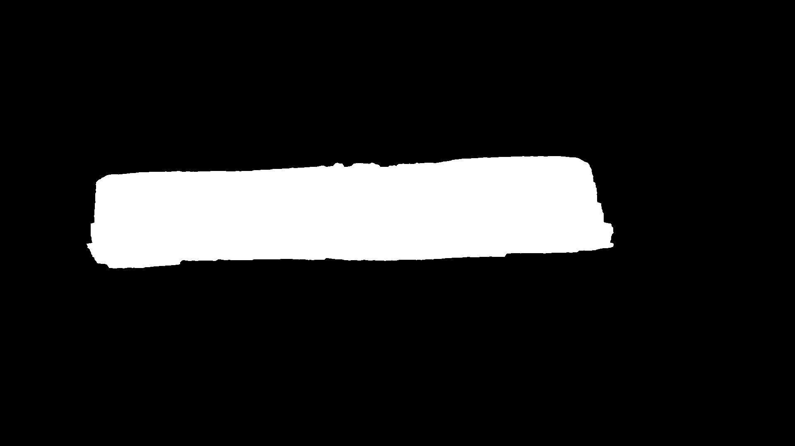
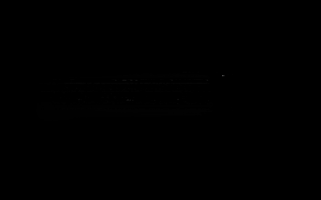

## Wood Warping Detection System with OAK‑D Lite 3D Camera and Raspberry Pi 5

Wood_QA captures RGB and depth from a Luxonis OAK‑D Lite, segments the wood panel from the RGB image, masks the depth map, and exports a 3D point cloud for downstream quality analysis.

This project is designed to run on a Raspberry Pi 5 connected to an OAK‑D Lite 3D camera. It can also run on a desktop (Windows/Linux/macOS) for development.

### Highlights
- **Hardware**: OAK‑D Lite 3D camera, Raspberry Pi 5
- **Capture**: Saves one RGB frame and one depth map from OAK‑D Lite
- **Segmentation**: Uses CLIPSeg to isolate the wood panel in the RGB image
- **3D**: Applies the mask to the depth map and exports a `.ply` point cloud

---

## Repository structure
```text
Wood_QA/
├─ src/
│  ├─ cam_output.py         # Captures RGB and depth from OAK‑D Lite and saves pngs
│  ├─ extract_wood.py       # Segments wood panel from RGB, masks depth map
│  ├─ depth_to_cloud.py     # Converts masked depth map to point cloud (PLY)
│  └─ deviation.py          # Utilities for geometric deviation (optional)
├─ LICENSE
├─ requirements.txt
└─ README.md

```

---

## Example end-to-end run (outputs)

Below is one example pass through the full pipeline so visitors can see what each step produces. All images and files referenced below live in this repository after running the scripts once.

#### 1) cam_output.py → RGB and depth

Generated files:
- `rgb_image.png`
- `depth_map.png`

Images:





#### 2) extract_wood.py → Masked panel

Inputs:
- `rgb_image.png` and `depth_map.png` from step 1
- Reference picture: `rgb_image.png` (for best segmentation results)

Outputs:
- `wood_panel_mask.png`
- `wood_panel_depth_map.png`

Images:
Input Wood Reference Image


Output Images




#### 3) depth_to_cloud.py → Point cloud (PLY)

Input: `wood_panel_depth_map.png`

Output: `point_cloud.ply`

- Uses OAK‑D Lite intrinsics in `src/depth_to_cloud.py` to lift pixels to 3D.
- The PLY is ASCII and viewable in many 3D tools (e.g., MeshLab, CloudCompare).

Preview of `point_cloud.ply` content (header + a few points):

```text
ply
format ascii 1.0
element vertex 123456  # example count
property float x
property float y
property float z
end_header
0.012 0.034 0.567
0.013 0.035 0.568
0.014 0.036 0.569
...
```

You can download/open the generated PLY after running step 3: [point_cloud.ply](point_cloud.ply).

#### 4) deviation.py → Flatness assessment

Input: `point_cloud.ply`

Outputs:
- `deviations.txt` — per‑point vertical deviations from the best‑fit plane
- Console result indicating whether the panel is FLAT or WARPED

Example console output:

```text
Fitted plane: z = 0.000123*x + -0.000045*y + 0.012345
Standard deviation of vertical deviations: 0.003200 meters
Wood panel is FLAT (std dev <= 0.005)
```

`deviations.txt` is a long list of floating‑point values (meters). Here’s a truncated preview so you know what’s inside without scrolling a huge file:

<details>
  <summary>View sample of deviations.txt</summary>

```text
-2.574865008443011881e-03
-2.571690188092248981e-03
-2.568515367741486081e-03
-2.565340547390723182e-03
-2.558990906689197382e-03
-2.555816086338434483e-03
 ...
 (thousands of lines omitted)
```

Open the full file here after running: [deviations.txt](deviations.txt).
</details>

---

## Hardware requirements
- **Luxonis OAK‑D Lite** (USB‑C)
- **Raspberry Pi 5** (4GB or 8GB recommended) with Raspberry Pi OS 64‑bit (Bookworm or newer)
- USB‑C power supply and cable for the camera

Optional: You can also develop on a Windows/Linux/macOS machine with a connected OAK‑D Lite.

---

## Software requirements
- Python 3.10+ (3.11 recommended)
- pip 23+
- The following Python packages:
  - `depthai`
  - `opencv-python` (or `opencv-python-headless` on headless systems)
  - `numpy`
  - `pillow`
  - `torch` (PyTorch)
  - `transformers`

> Note: On Raspberry Pi, PyTorch wheels can be large and may take time to install. CPU inference is fine for CLIPSeg but slower than desktop GPUs.

---

## Raspberry Pi 5 setup

1) Update OS and install system dependencies
```bash
sudo apt update && sudo apt upgrade -y
sudo apt install -y libusb-1.0-0-dev python3-venv python3-pip
```

2) Add udev rules for OAK‑D (Linux only)
```bash
echo 'SUBSYSTEM=="usb", ATTR{idVendor}=="03e7", MODE="0666", GROUP="plugdev"' | sudo tee /etc/udev/rules.d/80-movidius.rules
sudo udevadm control --reload-rules && sudo udevadm trigger
sudo usermod -aG plugdev $USER
```
Log out/in (or reboot) so the group change takes effect.

3) Create and activate a Python virtual environment
```bash
cd Wood_QA
python3 -m venv .venv
source .venv/bin/activate
python -m pip install --upgrade pip
```

4) Install Python dependencies
```bash
pip install requirements.txt
```

5) Verify the camera is detected
```bash
python -c "import depthai as dai; print(dai.Device.getAllConnectedDevices())"
```
You should see a non-empty list with your device info. You can also run:
```bash
python -m pip install depthai-cli
depthai -l      # list devices
depthai cam_test
```

---

## Windows/macOS/Linux (desktop) setup
1) Ensure Python 3.10+ is installed
2) Create and activate a venv, then install dependencies
```bash
python -m venv .venv
. .venv/Scripts/activate   # Windows PowerShell: .venv\Scripts\Activate.ps1
python -m pip install --upgrade pip
pip install depthai opencv-python numpy pillow torch transformers
```
3) Plug in the OAK‑D Lite via USB‑C and continue with the workflow below.

---

## Data flow and usage

### 1) Capture RGB + depth from OAK‑D Lite
This produces two files in the project root: `rgb_image.png` and `depth_map.png`.
```bash
python src/cam_output.py
```

Notes:
- The script connects to the OAK‑D Lite, grabs one RGB frame and one depth frame, normalizes the depth for visualization, and saves both as PNGs.
- If you need multiple frames or a live preview, consider adapting `src/cam_output.py` accordingly.

### 2) Segment the wood panel and mask the depth map
Prepare a reference image of the wood panel (any representative photo) and place it in the project root as `wood_reference.png`.

New change: The RGB image (`rgb_image.png`) taken by the OAK-D Lite Camera is used as the reference image for the CLIPSeg model.
```bash
python src/extract_wood.py
```
Outputs:
- `wood_panel_mask.png` — binary mask of the segmented panel
- `wood_panel_depth_map.png` — depth map masked to the panel region

Note:
- CLIPSeg runs on CPU by default; on Raspberry Pi this could take time.

### 3) Export a 3D point cloud (PLY)
```bash
python src/depth_to_cloud.py
```
Outputs:
- `point_cloud.ply` — ASCII point cloud of the panel surface

Camera intrinsics:
- `src/depth_to_cloud.py` contains example intrinsics for OAK‑D Lite at 400p. For accurate geometry, replace these with your device intrinsics.
- You can retrieve calibration from DepthAI (e.g., via `dai.Device().readCalibration()`) and set `fx`, `fy`, `cx`, `cy` accordingly.
- Ensure the depth scale matches the units (e.g., `DEPTH_SCALE = 0.001` if your depth is in millimeters).


## Common issues and troubleshooting
- **No device found / permission denied (Linux/RPi)**: Ensure udev rules are installed and you’re in the `plugdev` group. Reboot after changes.
- **PyTorch install on Raspberry Pi**: If installation is slow or fails, try a prebuilt wheel for your Pi OS version. CPU inference will be slower but acceptable for testing.
- **Black/empty depth**: Make sure stereo depth is enabled and the camera has texture/lighting. Verify with `depthai cam_test`.
- **Wrong scale/units in point cloud**: Confirm the depth scale and camera intrinsics in `src/depth_to_cloud.py`.
- **Reference image mismatch**: Ensure `wood_reference.png` depicts the target panel class; otherwise segmentation may be poor.

---

## Tips for customization
- Change capture resolution and streams in `src/cam_output.py` (e.g., color resolution, depth preset, post-processing).
- Swap CLIPSeg with another segmentation model if you need higher accuracy or speed.
- Add metrics (flatness, warp, bow) on top of `wood_panel_depth_map.png` or the exported `point_cloud.ply`. See `src/deviation.py` as a starting point.

---

## Quick checklist
- **Hardware**: OAK‑D Lite connected over USB‑C; Raspberry Pi 5 powered
- **Env**: Python 3.10+, venv activated, dependencies installed
- **Run**:
  1. `python src/cam_output.py`
  2. Put `wood_reference.png` in repo root
  3. `python src/extract_wood.py`
  4. `python src/depth_to_cloud.py`

---

## Acknowledgments
- Built with the **Luxonis DepthAI** stack and tested with **OAK‑D Lite**
- Target platform: **Raspberry Pi 5**
